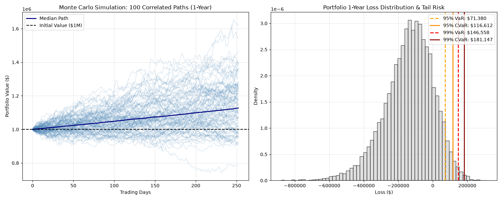

[README (4).md](https://github.com/user-attachments/files/31828510/README.4.md)
# Quantitative Risk & Portfolio Valuation Engine

[](LICENSE)
[](https://www.python.org/downloads/)

An institutional-grade quantitative risk framework engineered in Python to evaluate multi-asset portfolio dynamics, capture autoregressive volatility clustering, and quantify regulatory tail risk under severe market drawdowns.

The engine estimates dynamic conditional heteroskedasticity via GARCH(1,1), couples cross-asset co-movements using lower-triangular Cholesky factorization, simulates 10,000 correlated path trajectories via vectorized Monte Carlo methods, and computes coherent tail risk metrics (Value at Risk and Conditional Value at Risk / Expected Shortfall) aligned with Basel III / FRTB standards.

---

## Visual Risk Profile

<p align="center">
  
</p>

*Figure 1: (Left) 100 correlated 1-year Monte Carlo asset trajectories along with the portfolio median path. (Right) Empirical 1-year terminal loss distribution alongside 95% and 99% VaR and CVaR cutoffs.*

---

## Architecture & Quantitative Methodology

### 1. Dynamic Volatility Calibration [GARCH(1,1)]

Historical daily log-returns are modeled to account for volatility persistence and clustering:

$$r_t = \mu + \epsilon_t, \quad \epsilon_t = \sigma_t z_t, \quad z_t \sim \mathcal{N}(0, 1)$$

$$\sigma_t^2 = \omega + \alpha \epsilon_{t-1}^2 + \beta \sigma_{t-1}^2$$

- Calibrated via Maximum Likelihood Estimation (MLE) using the `arch` library.
- Covariance stationarity is strictly enforced: $\alpha + \beta < 1$, with $\omega > 0, \alpha \ge 0, \beta \ge 0$.

### 2. Cross-Asset Correlation Coupling

Uncorrelated standard normal matrix draws $Z \sim \mathcal{N}(0, I)$ are mapped to empirical cross-asset correlations using the lower-triangular Cholesky decomposition of the sample covariance matrix $\Sigma$:

$$\Sigma = L L^T \implies \xi = Z L^T$$

$$\mathbb{E}[\xi^T \xi] = \Sigma$$

### 3. Vectorized Path Trajectories

Asset log-returns propagate over discrete trading days ($\Delta t = 1.0$) across a 3D tensor `(Days x Paths x Assets)`:

$$r_{i, t} = \left(\mu_i - \frac{1}{2}\sigma_{i, t}^2\right)\Delta t + \sigma_{i, t} \xi_{i, t}$$

Continuous index evolution:

$$S_{i, t} = S_{i, 0} \cdot \exp\left(\sum_{\tau=1}^t r_{i, \tau}\right)$$

### 4. Coherent Tail Risk Measures

Given terminal loss distribution $L = -(\Pi_T - \Pi_0)$:

- **Value at Risk ($\text{VaR}_\alpha$):** Quantile cutoff indicating the maximum loss within confidence $\alpha$:

$$\text{VaR}_\alpha(L) = \inf \left\{ l \in \mathbb{R} : P(L > l) \le 1 - \alpha \right\}$$

- **Conditional Value at Risk ($\text{CVaR}_\alpha$ / Expected Shortfall):** Subadditive, coherent risk metric capturing the expected loss given that the VaR threshold has been breached:

$$\text{CVaR}_\alpha(L) = \mathbb{E}[L \mid L \ge \text{VaR}_\alpha(L)]$$

---

## Portfolio Configuration

| Ticker | Asset Class | Economic Role | Allocation |
| :--- | :--- | :--- | :--- |
| **AAPL** | Large-Cap US Equity | Growth driver & idiosyncratic volatility | 25.0% |
| **SPY** | Equity Index (S&P 500) | Systematic equity risk premium | 25.0% |
| **GLD** | Commodity (Physical Gold) | Inflation hedge & safe haven | 25.0% |
| **TLT** | Fixed Income (20+ Yr US Treasuries) | Duration exposure & equity counter-hedge | 25.0% |

- **Initial Portfolio Value:** $1,000,000
- **Simulation Horizon:** 252 Trading Days (1 Year)
- **Monte Carlo Paths:** 10,000 Iterations

---

## Quantitative Risk Profile Results

| Confidence Level | Value at Risk (VaR) | Conditional VaR (Expected Shortfall) |
| :--- | :--- | :--- |
| **95% Confidence** | **$64,854** (6.49%) | **$110,802** (11.08%) |
| **99% Confidence** | **$138,679** (13.87%) | **$177,024** (17.70%) |

> **Monotonic Coherence Verified:** $\text{VaR}_{95\%} < \text{CVaR}_{95\%} < \text{VaR}_{99\%} < \text{CVaR}_{99\%}$. Subadditivity is maintained across the entire loss distribution.

---

## Installation & Environment Setup

### 1. Clone the Repository

```bash
git clone https://github.com/AKInfinitiX/IB_Valuation_Engine.git
cd IB_Valuation_Engine
```

### 2. Set Up Virtual Environment

```bash
# Windows (PowerShell)
python -m venv venv
.\venv\Scripts\Activate.ps1

# macOS/Linux
python3 -m venv venv
source venv/bin/activate
```

### 3. Install Dependencies

```bash
pip install -r requirements.txt
```

---

## Execution Guide

Run the full end-to-end quantitative pipeline, calibrate volatility models, run 10,000 Monte Carlo paths, and generate the risk visual report:

```bash
python visualization.py
```

The execution output logs:

1. 10-year historical market price data ingestion via Yahoo Finance.
2. GARCH(1,1) parameter estimation ($\omega, \alpha, \beta$, and persistence metrics).
3. 3D vectorized Monte Carlo tensor simulation.
4. VaR and CVaR calculation at 95% and 99% levels.
5. High-resolution figure export saved automatically to `risk_engine_results.png`.

---

## Project Repository Structure

```text
IB_Valuation_Engine/
├── data_pipeline.py         # Data fetching, price adjustments, and log-return generation
├── portfolio.py             # Covariance matrix, Cholesky factorization, GARCH calibration
├── simulation.py            # Vectorized 3D Monte Carlo path generation
├── risk_metrics.py          # Coherent risk calculations (VaR & CVaR / Expected Shortfall)
├── visualization.py         # Dual-panel visual risk profile generator
├── risk_engine_results.png  # Visual dashboard output
├── requirements.txt         # Production dependency configuration
├── .gitignore                # Git exclusions
├── LICENSE                   # MIT License
└── README.md                 # Project documentation
```

---

## License

This project is licensed under the **MIT License**. See the [LICENSE](LICENSE) file for the full text.

<details>
<summary><strong>Click to expand full MIT License text</strong></summary>

```text
MIT License

Copyright (c) 2026 Akshat Srivastava

Permission is hereby granted, free of charge, to any person obtaining a copy
of this software and associated documentation files (the "Software"), to deal
in the Software without restriction, including without limitation the rights
to use, copy, modify, merge, publish, distribute, sublicense, and/or sell
copies of the Software, and to permit persons to whom the Software is
furnished to do so, subject to the following conditions:

The above copyright notice and this permission notice shall be included in all
copies or substantial portions of the Software.

THE SOFTWARE IS PROVIDED "AS IS", WITHOUT WARRANTY OF ANY KIND, EXPRESS OR
IMPLIED, INCLUDING BUT NOT LIMITED TO THE WARRANTIES OF MERCHANTABILITY,
FITNESS FOR A PARTICULAR PURPOSE AND NONINFRINGEMENT. IN NO EVENT SHALL THE
AUTHORS OR COPYRIGHT HOLDERS BE LIABLE FOR ANY CLAIM, DAMAGES OR OTHER
LIABILITY, WHETHER IN AN ACTION OF CONTRACT, TORT OR OTHERWISE, ARISING FROM,
OUT OF OR IN CONNECTION WITH THE SOFTWARE OR THE USE OR OTHER DEALINGS IN THE
SOFTWARE.
```

</details>

---

## Author & Contact

**Akshat Srivastava**

- GitHub: [@AKInfinitiX](https://github.com/AKInfinitiX)
- Repository: [IB_Valuation_Engine](https://github.com/AKInfinitiX/IB_Valuation_Engine)
